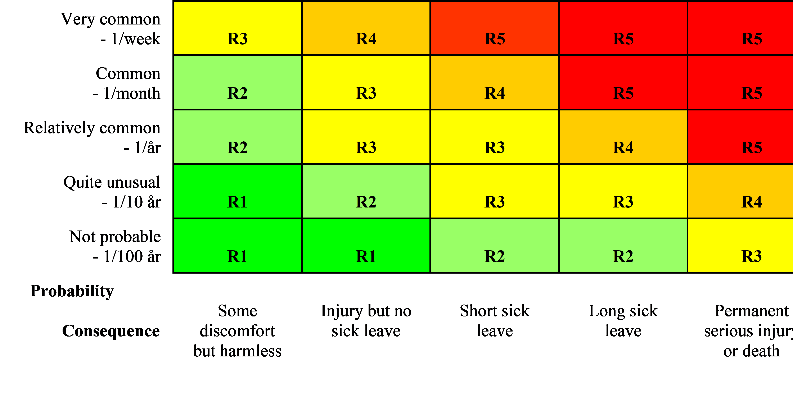
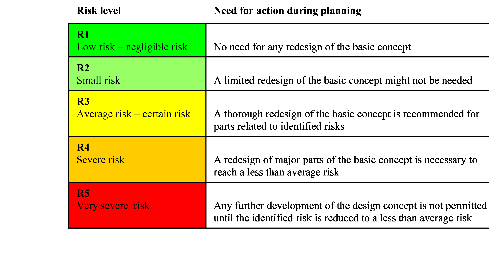
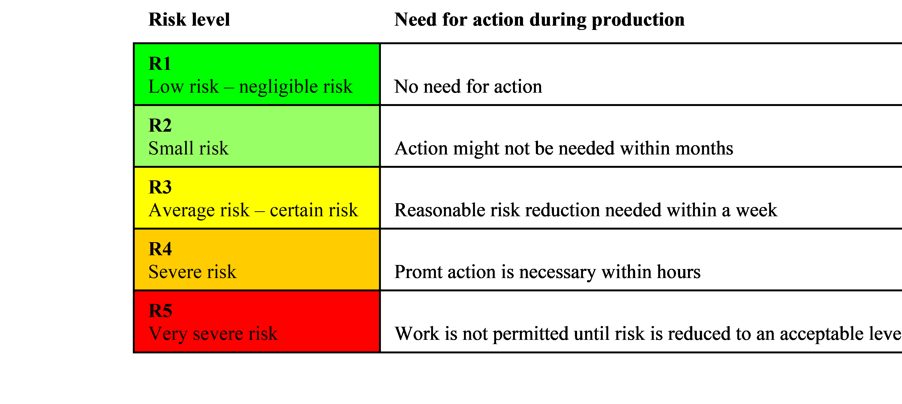

# Fix the problems before they occur

A heavy responsibility for safe mines lays on the mine planners
shoulders. They must find solutions that promote high productivity and
good economy as well as safety and a healthy work environment. The mine
planners will initially shape the general and specific work environment
for miners for many years to come. If the planners design a poor
solution and it is necessary to redesign it, it will also probably be
very expensive to correct after it has been implemented.

Work environment and safety issues are unfortunately often left quite
unattended in the early stages of mine planning and design when they
instead should be systematically highlighted and developed from the very
first planning steps. The best and most efficient way to gain a good
safety is through proactive planning instead of reactive corrective
actions. It is also the best way to reduce the associated costs for risk
elimination and reduction.

The mine planner is however not alone, he or she works in a company
context where safety climate and culture, safety policy and safety
management have a strong influence on how well the planner can succeed
in his work.

The slogan "Safety first" has been heard in the mining business for many
decades but is still in many cases not more than a slogan since safety
first is not fully practiced, especially if the business has financial
problems. It seems however that the times are changing and many mining
companies are now making great efforts to improve their safety climate
and safety culture. Research on safety has shown that at positive safety
climate and well developed safety culture is an important requisite for
a healthy and safe work environment, especially in heavy industries.

In order to manage the risks in the business every mining company is
also in need of a strategic long-term policy regarding how to deal with
safety issues and strive for better work conditions. The safety policy
shall direct and establish systematic ways to manage (plan, steer and
control) the safety work, also including early planning and design
activities.

Because mining is a very risky business it has to follow and obey a lot
of directives, laws and provisions. Most of these rules only stipulate
minimum demands and the companies are free to exceed them. This is also
what mine planners should aim at, exceeding minimum demands. A first
step for a mine planner is therefore to get acquainted with the national
and international (ie EU regulations) system of rules and basic demands.
Many of these demands are provided by the national or EU authorities.
This has to be done in a thorough way in each country there are quite a
large number of directives, laws and provisions that regulate and give
guidelines for health and safety issues in underground mining.

The basis for all activities in systematic health and safety work shall
always be an initial thorough risk assessment both of the present state
and a future planned state. It is of course easier to assess present or
historical risks than future risks, especially if the future holds large
changes in technology and or work organization. Still a mine planner
needs to assess the risks with different mining concepts that are
developed and planned.

Mining might develop in a revolutionary way, but will most probably
develop in another way, in an evolutionary way. This means that much can
be learned from history and from the present state. Thorough evaluations
of present and historic designs have for example systematically been
used by the Swedish mining company LKAB in the design of their newest
main level at 1365 m below surface. This evaluation has been very
important since the time span from the first conceptual designs to the
final solutions has stretched over 12 years and a large number of
planners.

Risk assessments can be performed in number of ways depending on the
situation and circumstances. All risk assessment shall however be based
on probability and consequence for unwanted events. A practical tool for
this purpose is a risk matrix that eases a systematic and consequent
risk assessment (see figure \@ref(fig:risk-analysis)).

```{r risk-analysis, echo = FALSE, fig.cap = 'Risk matrix based on probability and consequence.'}

```

As can be seen in figure \@ref(fig:risk-analysis) probability is expressed as a frequency for a
specific event or deviation. The assessed risk level during planning can
also be coupled to a specified need for action, (see
\@ref(fig:risk-level-planning)).

```{r risk-level-planning, echo = FALSE, fig.cap = 'Risk level and need for action during planning'}

```

The risk matrix for risk assessments during planning can also with some
modification be used for risk assessments in the operative production
stages (see \@ref(fig:risk-level-production)). The risk matrix has
therefore become a quite well known and used tool in the mining
companies.

```{r risk-level-production, echo = FALSE, fig.cap = 'Risk matrix based on probability and consequence.'}

```

The classical tools for the identification of occupational risks in the
existing production environments are Safety rounds, Incident and
Accident reporting. These tools are however less suitable to identify
and assess risks in future work environments. There you need other types
of more proactive methods such as:

-   Preventive deviation analysis

-   Preventive energy analysis

A deviation is according to @Harms-Ringdahl2013 defined as an event or
condition that deviates from the intended or normal. The purpose of a
deviation analysis is to prevent, to predict abnormalities that can
cause damage and to develop proposals to improve safety measures.
Deviation Analysis is a very useful method since it takes into account
the entire system, Human-Technology-Organization. Energy analysis
focuses more on technology and might be useful when developing new
productions systems. Three main components considered in an energy
analysis are:

-   Energy that can damage

-   Targets that may be harmed

-   Barriers to Energy

The energies usually considered are: Gravity, height (including static
load); Linear motion; Rotary motion; Stored pressure; Electrical energy;
Heating and cooling; Fire and explosion; Chemical effects; Radiation;
Miscellaneous (human movement, sharp edges, and points).

There are also many other different risk analysis methods that can be
used during the development of new production systems. Besides the
methods mentioned above methods like Preventive Work Safety Analysis
(PWSA), Failure Mode Effect Analysis (FMEA), Fault Tree Analysis (FTA),
Event Tree Analysis (ETA), Work Environment Screening Tool (WEST) etc.
are possible to use. The most appropriate tools have to be chosen for
every specific analysis task and the users of the tools must also have
the necessary competence in order to attain reliable and relevant
results. Here the mining business probably can learn much from other
industry that has a strong safety culture and long experience of
systematic risk management. Especially important will be to learn how to
proactively manage risks for fatalities and other severe risks. Here so
called leading indicators are preferred instead of lagging indicators

Even if there are many risk evaluation tools available mining industry
seem to need new and efficient tools for description, evaluation and
design of work environment during early phases of strategic decision
making and production system design. The most important decisions
regarding work environment and safety are made by top management when
mining methods, technology, work organization etc. is decided. Therefore
risk analyses regarding these matters should be made as early as
possible in the mine design process.

Once a risk analysis is completed it often requires measures which in
most situations should be implemented in the following well known order:

1.  Prevent already in the planning stage, replace the hazards entirely.
    For example, through automation to eliminate manual or mechanized
    underground work.

2.  Isolate the individual hazard, risk process. For example, by
    designing ventilation and layout so that the blasting fumes can't be
    spread outside the risk zone.

3.  Change process technology and behavior. For example, DTH-drilling
    with water hydraulics rather than pneumatics to reduce dust
    emissions.

4.  Limit the hazard through enclosures, physical protection. For
    example, build concrete borders and railings at the shaft openings.

5.  Isolate personnel from the hazard risk area. For example, by
    supplying the mining vehicles with safety cabs with good climate
    control.

6.  Risk is reduced by instructions, procedures, training, etc. For
    example, procedures for safe handling of explosives.

7.  Risk is reduced through personal protective equipment. For example,
    functional working clothes.

Depending on the complexity and severity of problems one may require
different combinations of measures as described above. One
recommendation is to always try to attack the root causes of the problem
first. It tends to result in the most cost efficient and result
efficient solutions. This is an important task for mine planners. They
have the best opportunity to eliminate a lot of potential health and
safety problems when they develop the first conceptual solutions.
Planners that don't realize this and neglect these matters can cause
great harm for many years to the mining personnel and their company.
