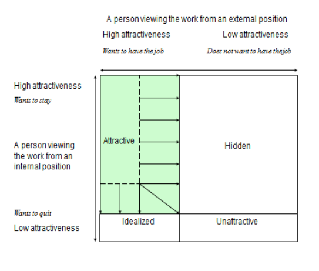

**5. Attracting young people to the mining industry**

Jan Johansson, Bo Johansson, Joel Lööw, Magnus Nygren and Lena Abrahamsson

In most mines the present workforce is ageing and mining companies have difficulties recruiting young talented people. A precondition for being able to recruit the right workforce is that the mining industry can offer workplaces that attract the youths of tomorrow. In order to succeed, the mining companies need to know what in fact constitute attractive jobs and workplaces in mining as well as how they can change their own present operations to align with these requirements. These changes need to be based on current and relevant research on work attractiveness. However, labour supply is determined not only by the work itself and the working environment but just as much of the society and what it can offer its residents. There are a number of factors that have an impact on the attractiveness of society, such as social relations to family, friends and relatives, opportunities regarding work and education, housing and leisure activities. These factors must also be considered when creating the mines of the future.

Unfortunately, there is no single accepted definition of what constitutes an attractive job and current explanations and models differ. While pay and the possibilities of advancement are two general factors, answers have varied in, for example, different time periods and fields of research. It follows that what is attractive also differs between countries, since the general contexts differ, as well as individuals.

A general model for attractive work is presented by Åteg et al. (2004). In this model, three factors, covering 22 dimensions (see The table), interact and contribute to the attractiveness of work. For a detailed description of the various dimensions, see Chapter 4. In comparison with previous, similar models Åteg et al. have added work satisfaction as a factor. This factor is especially important for keeping people at work, Åteg et al. argue.

:  Work attractiveness.

+-----------------------------------+-----------------------------+-----------------------+
| **Attractive working conditions** | **Attractive work content** | **Work satisfaction** |
+-----------------------------------+-----------------------------+-----------------------+
| Adequate equipment and tools      | Work pace                   | Demand, need          |
|                                   |                             |                       |
| Working hours                     | Familiarity                 | Recognition           |
|                                   |                             |                       |
| Physical work environment         | Physical activity           | Status                |
|                                   |                             |                       |
| Leadership                        | Freedom to act              | Stimulation           |
|                                   |                             |                       |
| Loyalty                           | Practical work              | Results               |
|                                   |                             |                       |
| Location                          | Theoretical work            |                       |
|                                   |                             |                       |
| Wage                              | Variation                   |                       |
|                                   |                             |                       |
| Organization                      |                             |                       |
|                                   |                             |                       |
| Relations                         |                             |                       |
|                                   |                             |                       |
| Social contact                    |                             |                       |
+-----------------------------------+-----------------------------+-----------------------+

In another model, Hedlund (2007) states that a job is attractive for a person if he/she wants the job and wants to keep it. Thus, an individual can judge the attractiveness both as an applicant (external view) and as an employee (internal view). This means that a job can be described in four different ways: attractive, hidden, idealized and unattractive (see Figure 1). Accordingly, a job is attractive if it has a high attractiveness from both an internal and an external point of view. A job with high internal attractiveness but low external attractiveness is classified as hidden, while a job with low internal attractiveness but high external attractiveness is regarded as idealized. Finally, a job that has a low attractiveness from both an internal and external view is classified as unattractive.

Thus an individual's relation to work, experience of work and wishes and expectations are important components that form the perception of work attractiveness, i.e. different people have varying opinions of the same job depending on their personal situation and preferences. In essence, it can be said that the relative importance of each dimension in the model by Åteg et al. (2004) depend on the individual. Additionally, we argue that the weight of a dimension may even be negative. This has the effect that an "objectively" attractive job may be perceived as unattractive.

{width="3.7493055555555554in" height="2.89375in"}

In Figure 1 we have used Hedlund's (2007) model to illustrate a plausible present situation for the mining sector. The attractive section is quite small and the view from an internal position is more positive than one from an external position. Thus we argue that the mining industry needs to expand job attractiveness, both for external and internal viewers. As was shown in the above models, this expansion can be achieved in a large number of ways. Essentially, present attractive qualities must be presented and not hidden away from applicants and potential staff. Unattractive or repelling job features must be eliminated or decreased.

{width="3.6347222222222224in" height="3.0854166666666667in"}

The question is how to achieve this expansion of attractiveness. Based on our experiences from the SIMS project and other similar projects, we have summarized our findings in six recommendations for creating attractive workplaces and increasing the visibility of the good parts of mining work:

-   Health and safety at work must have top priority. Mechanization, remote control, and automation are efficient preventive safety measures, but are also appropriate for reducing workload to avoid musculoskeletal injuries and allow for recovery periods. Improved safety is also a matter of a developed safety climate in the form of relevant education, rules and effective leadership where safety clearly is prioritized in the day-to-day-work.

-   A work organization based on groups as an operative unit where all employees have control over their own work cycle. This very concrete demand guarantees a variety at work while also providing meaningful autonomy. The demand can also be combined with a Lean approach.

-   Competence development, and learning at work are important to guarantee flexibility for the company and development in one's professional role. It is also a question about changing into a workplace culture that follows the developments in the industry, such as new production techniques, new products, and new quality demands.

-   Gender equality is essential for the mining industry to being viewed as a modern employer. The industry must break away from its macho-masculine image.

-   The mining companies must more actively demonstrate their social responsibility. Employees want to feel proud to work in the company, so issues such as vision, mission and core values are important.

-   Focus should be placed on the benefits as well as the potential problems that may come with having a workforce consisting of both in-house personnel and contractors. This includes an emphasis on strengthening both the formal (e.g. implementing joint safety management practices) and informal (e.g. communication and interaction on a workplace level) relations on the emerging multi-employer worksites.

Finally, if the mining industry wants to improve its image and recruit young people in the future, they have to broaden their perspective. New technology is important and can solve many problems, but not all of them. Technology must be complemented with a social perspective that includes attractive and safe workplaces in a social functioning society, sought-after workplaces in a company that people are proud to work for.
