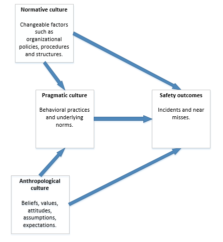

# Understanding, and improving, safety culture # 

```{block, type='chap-auth'}
Magnus Nygren
```

Safety work has evolved over time in the mining industry. In the 1980s and 1990s, a focus was to a significant extent placed on technological solutions such as improved protection from hazards related to blasting and safer and more efficient machinery. New laws and regulations have also come into effect in recent decades that have led to more systematized risk management practices overall. Although technological solutions and the implementation of formal rules still play an important part, there has been a trend towards finding more-novel organizational solutions for safety-related issues. One such solution is improving the *safety culture* within the companies.

Safety culture can be defined as the "shared and learned meanings, experience and interpretations of work and safety---expressed partially symbolically---which guide peoples' actions towards risks, accidents and prevention" (Richter & Koch, 2004, p. 705). In practice, improving safety culture often involves a focus on encouraging safe behaviours, including the introduction of new procedures that are seen as facilitating certain types of behavioural practices. However, safety culture is a complex phenomenon that also involves interactions and exchanges among the workers themselves; i.e., safety culture emerges in a "bottom-up" fashion and may establish worker-specific norms and values that are outside of the direct control of management.

The notion of safety culture being something that both management can improve and something that evolves naturally among the workers themselves is succinctly encapsulated in a model by Edwards et al. (2013) (@fig:figure91).

{#fig:figure91}


Safety outcomes can thus be seen as being dependent on three different "types" of culture that interact with each other in complex ways -- or rather that three different perspectives can be used on the nature and characteristics of culture. Normative culture highlights that specific structures, policies and procedures will make certain behavioural practices more likely to occur (i.e., pragmatic culture) that, in themselves, are affected by the beliefs, values and expectations of the workers (i.e., anthropological culture). However, while taking the interconnectedness of the three perspectives into account, a dedicated focus by management on implementing appropriate structures, policies and procedures is clearly a promising avenue for cultural change. One reason for this promise is that the formal structures and processes of an organization are under the direct control of management and, consequently, something that can be fairly easy to change, which eventually may have an effect on the meaning workers ascribe to safety. For example, Guldenmund (2010) suggests that the safety management system of an organization may play an important part in creating meaningful safety practices for the workers by, e.g., making clear what is expected of them in their daily work. Nevertheless, it is also important to consider how new initiatives will be perceived and interpreted by the workers given that the culture, in the anthropological sense described above, can be seen as something "belonging" to the members of the organization themselves. If the suggested changes to policy and procedures are not consistent with what the workers expect and need, there may be a resistance to change or, in other words, a clash between cultures. Of course, some policies and procedures may be non-negotiable, for example wearing personal protective equipment and following safety rules, but it is important to reflect on the actual consequences that management-led initiatives will have from a cultural perspective.

As seen, safety culture is a complex phenomenon, and there are no easy solutions or implementation strategies. The literature, however, offers additional considerations for mining companies when they are seeking to develop their culture:

-   It is important to consider cultural issues in relation to other vital aspects of workplace safety, such as the current and future levels of technology development. Mining companies operate in conditions of intricate technical, physical and organizational relationships; everything is connected to everything, and it is important to consider both "soft" (e.g., safety culture) and "hard" (e.g., technology development) perspectives on safety (Lööw & Nygren, 2019).

-   Cultural change may require several years, even decades, to come into effect (Guldenmund, 2010); thus, management needs to take this requirement into account when developing and implementing new structures and processes aimed at supporting the development of safety culture.

-   If a mining company hires contractors, it is important to consider how the workers of these external companies can be integrated into the structures and processes of the mining company and the level of integration that is appropriate given the formal division of responsibilities between different employers (Lööw & Nygren, 2019). A reasonable start could be to synchronize the safety management systems of every company involved with that of the mining company. Cultural integration, in itself, may not be possible or even desirable due to the often-short-term projects contractors are hired to perform. However, introducing the workers to the context for safety work can clarify what kind of meaning should be placed on safety and that it is everyone's responsibility to act accordingly.

**References**

Edwards, J.R.D., Davey, J., & Armstrong, K. (2013). Returning to the roots of culture: A review and re-conceptualization of safety culture. Safety Science, 55, 70--80.

Guldenmund, F.W. (2010). (Mis)understanding safety culture and its relationship to safety management. Risk Analysis, 30(10), 1466--1480.

Lööw, J., & Nygren, M. (2019). Initiatives for increased safety in the Swedish mining industry: Studying 30 years of improved accident rates. Safety Science, 117, 437--446.

Richter, A., & Koch, C. (2004). Integration, differentiation and ambiguity in safety cultures. Safety Science, 42, 703--722.


