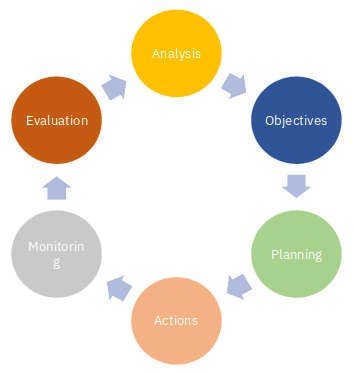

# Working for gender equality in organizations -- a model# 

```{block, type='chap-auth'}
Eira Andersson & Lisa Ringblom
```

To work for increased gender equality in organizations requires a systematic and long-term approach. We suggest here a model for that work (see @fig:figure121). The model focusses the work as a process, as a circular movement for learning and continuous improvements. The first step of the model for working for improved gender equality is analysis, which focusses on a situation assessment and collecting data about the current situation, an important aspect of all change processes within organizations as a basis for a new practice. Thereafter, the model takes on objectives, planning, actions, monitoring of the activities and, finally and importantly, evaluation of the process and its results to take on to the next cycle.

{#fig:figure121}


**Analysis:** A prerequisite to be able to work for gender equality, set goals and implement change, is access to basic facts about women and men's situation in the organization. An important part of gender equality work is a situation assessment from a gender perspective, e.g. a gender analysis, meaning that facts are gathered, and that gender patterns are made visible and analyzed. Gender divided statistics is a necessary tool for gender analysis. Gender divided statistics enfolds not only statistics by sex, the statistics must aim at visualizing men and women's conditions and needs at work and identifying problem areas. It is important to recognize both similarities and dissimilarities between men and women. A good way to start is to analyze issues of work division, task assignments, competence development, career paths to leadership positions, recruitment processes, sick leave, injuries, harassment cases, etc. -- from a gender perspective. To perform an in depth gender analysis, quantitative and qualitative, with the aim of addressing norms, you need competence specializing in this field. If the groundwork is in place according to good knowledge about the organization and women and men's condition, it is easier to introduce and implement new actions.

**Objectives:** With the basis of the given gender analysis, including a situation assessment and problem identification, it is now time to identify objectives, i.e., what you want to achieve (short term, long term, in numbers and/or other changes in the organization). A common mistake is to just formulate a general objective, e.g., increasing the number of women in the organization, gazing at numerical gender equality goals of X % in policy documents. A good way to start is for example the SMART tool. SMART goals are a tool used to formulate goals that are *Specific* (clearly defined), *Measurable* (can be measured and followed up), *Accepted* (by all actors involved), *Realistic and Relevant* and *Time-limited* (a deadline is provided). Aim at identifying objectives in both quantitative and qualitative terms.

**Planning:** Good results require good preparation. To achieve the aim of improved gender equality, it is important that in the early stages think about organizational conditions and make plans on how to go about it. A good planning process is important in change management and in all gender equality initiatives as such. The project/initiative/action needs a: 1. Budget, 2. Schedule/timetable, 3. Accountability, who/m is responsible and for what. Allocating of resources (money, time, capacity) is an important steep to formalize the project and to prepare the organization for the upcoming action and change. Do not forget that change management and gender equality initiatives have costs! An important issue in the planning phase is also to determine if there is a need for expertise outside the organization. Do we need specialized competence for example process leaders or gender experts?

**Action:** When the situation is analyzed and problem areas are visualized, when objectives are clearly defined and the preparation and planning is set, it is time to take action.

**Monitoring:** Monitoring and documentation of the process is very important to get a picture about the progress but also to pinpoint if the project is going in the wrong direction. If the set up is successful you can use the same systematics over an oven again. Another gain is that the knowledge and learning process is not connected to the process leader, project manager or its participants.

**Evaluation:** In all projects and in development work, it is important to evaluate and follow-up on the outcome, and actions for gender equality are no exception. To ask for results and evaluate the measures implemented is also a means of visualizing that gender issues are a priority and an important issue for the organization. Evaluation must be made of the result/outcome in relation to project-specific objectives, preferably both in quantitative and qualitative terms, but also as an evaluation of the process as a whole; what can we take with us to the next cycle? Finally, the entire process and its content should be carefully documented for the work to be implemented as an organizational structure that is easy to follow and evaluate and for the work not to be dependent on specific individuals in the organization.
