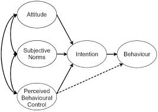
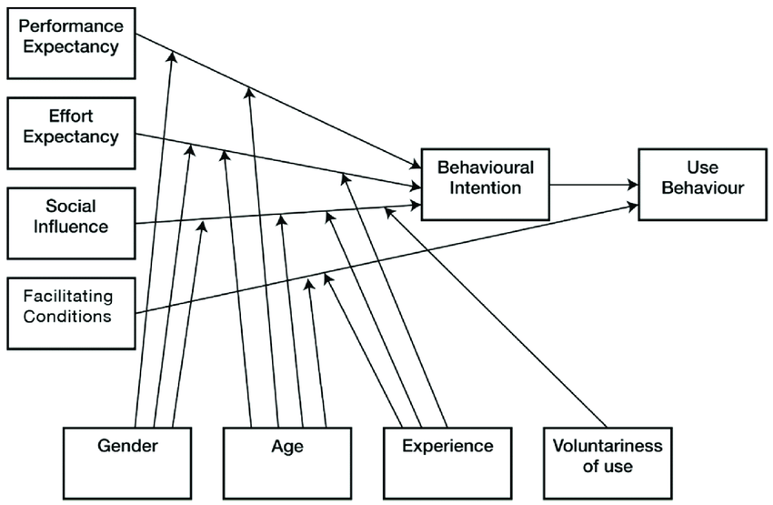

**16. Acceptance of new technology - the most prominent theories**

**Ny version kommer**

Introducing new technology in the mining industry is the future but will the users accept the new technology? The purpose of this chapter is to give a brief overview of theories/models that are important for understanding which factors affect the acceptance of new technologies.

Organizations in the modern industrialized world face a rapidly evolving environment that requires changes to be able to keep up with the requirements, and the mining industry is no exception. First we need to state that the human is generally skeptical about change, there is a fear of the unknown. Change can be perceived as stressful which leads to negative emotions and feelings of uncertainty which in turn can affect acceptance. There is of course variation in how well individuals embrace and accept change. Though, for technologies to be useful, they must be accepted and used by the employees in the organization (Venkatesh, Morris, Davis, & Davis, 2003). Therefore, when introducing new technology there are several aspects that need to be considered to gain acceptance and succeed with the implementation. We will now give a brief overview of the most prominent theories in this area.

**The Theory of Planned Behavior (TPB)**

The Theory of planned behavior (TPB), developed by Ajzen and Fishbein (1980, read in....), assumes that the decision to engage in a particular behavior is the result of a rational process. This means that humans take different behavioral options into consideration and then evaluate the different possible outcomes, and after that decide to behave in one way or another. The decision will lead to an intention to perform the chosen behavior. Intentions is suggested to be a good predictor of actual behavior, 

{width="2.779166666666667in" height="1.9708333333333334in"}

*Figure x.x. Skapa en egen bild*

**The Technology Acceptance Model (TAM)**

Technology is accepted when it is perceived as useful and easy to use. System design also affects user acceptance. In a study by Davis (1993), perceived usefulness was found 50 % more important for user acceptance than ease of use. That means, it is important to design based on user needs. Davis (exemplifies what is meant by perceived usefulness: the system is perceived to improve quality of work, gives greater control, enables the worker to accomplish tasks faster, supports critical aspects of work (i.e. decision mak-ing or monitoring), increases productivity, improves job performance, enhances effectiveness, and makes it easier to do the job. If a technology solution does not clearly show high usefulness by the user the user may be reluctant to use it. A system that is designed to control workers has high usefulness for management personnel but not necessarily for the workers. Highly effective workers may be positive to a control system since they may profit from their effectiveness being measured and observed. A control system may also be perceived as useful if its purpose is related to increased personal safety. Acceptance will be low if the workers do not see any benefits coming from the system.

**Unified Theory of Acceptance and Use of Technology (UTAUT)**

There are many models that attempt to determine what factors that affect information technology acceptance among the users. Based on eight such prominent models, including previously described TPB and TAM, Venkatesh, Morris, Davis and Davis (2003) presents a unified model, called the Unified Theory of Acceptance and Use of Technology (UTAUT). The model has been found to explain 70% of the variance in user intention (Venkatesh et al., 2003) and 50% in technology use (Venkatesh, Thong, & Xu, 2012).  According to UTAUT, four constructs are direct determinants of user acceptance and usage behavior, namely; *performance expectancy, effort expectancy, social influence*, and *facilitating conditions* (Figure X.X). Below the four constructs are briefly described.  

The construct *performance expectancy* is defined, by Venkatesh and colleagues (2003, p. 447), as the degree to which an individual believes that using the system will help him or her to attain gains in job performance. It is suggested to be the strongest predictor of behavioral intention to use and accept the technology (e.g. Zuiderwijk, Janssen, & Dwivedi, 2015). 

This implies that it is of great importance to make the usefulness of the new technology visible for the workers. 

The second construct, *effort expectancy*, is defined as the degree of ease associated with the use of the system (Venkatesh et al., 2003, p. 450). This means that although the users believe the technology to be useful, it will not be accepted unless they also believe the technology to be easy to use. 

It is therefore important to build and design technology on human terms. It may seem obvious that a technology should be useful and both efficient and effective to use. However, there are often several needs that are missed in the process. Some specific demands for operators in the mining industry that are important to consider when investing in usable technology is presented in Chapter x (Technology on human terms in a mining context).

Third, *social influence* is defined as the degree to which an individual perceives that important others believe he or she should use the system (Venkatesh et al., 2003, p. 451). The opinions of colleagues, managers, supervisors, family and friends may therefore be salient when an individual user is forming an intention to use new technology. This is especially true in mandatory settings, i.e. when using the technology is not optional (e.g. Venkatesh et al., 2003). The influence of others\' opinions tends to be highest in the early stages of experience with the technique, before the individual has had time to form their own opinion. 

This implies that it is important to view the implementation of new technology as a group process and therefore also handle it on a group level. Further, it is also extremely important to remember that workers are influenced by the management and therefore, managers must communicate support and believe in the system. This means that acceptance of the technology must permeate the entire organization.

The fourth construct, *facilitating conditions*, are defined as the degree to which an individual believes that an organizational and technical infrastructure exists to support the use of the system (Venkatesh et al., 2003, p. 453). This construct includes things such as the need for users to feel that they have the resources and knowledge necessary to use the system and that it is supported by the organization. There must also be possible to get help if difficulties with using the technique would arise. 

The model suggests the first three constructs to influence behavioural intention to use a technology, while the fourth is a direct determinant of user behavior (see Figure X.X). 

The UTAUT also consists of four moderating factors which are gender, age, experience and voluntariness of use (see Figure X.X). These moderators are expected to affect the relationship between the constructs and the intention to accept/use the technology. For example, performance expectancy has been found to be more salient for men and younger workers, while the opposite is found for effort expectancy. Further, women are suggested to be more sensitive (than men) for others' opinions when forming an intention to use new technology, however the effect is declining with experience. 

The complex interactions for gender and age is something to consider for being able to create equithe tableworkplace environments for women and men of all ages (Venkatesh et al., 2003). 

{width="6.5in" height="4.25in"}

*Figure X.X The variables and moderators in the UTAUT model. Denna är tagen rakt av från internet så vi behöver göra om den\...*

Since this model was introduced it has been used extensively by researchers when trying to explain the acceptance and use of technology. Although the model has been successful, newer research has found that these constructs and moderators are not always applicable to all contexts, and some crucial constructs may be excluded (Dwivedi, Rana, Jeyaraj, Clement, & Williams, 2019). Many studies have not utilized the moderating factors (Venkatesh et al., 2012), and one explanation might be that there may not be any variation in the moderators (Dwivedi et al., 2019). As an example, the organization might have decided that the use of the technology is mandatory, which makes the moderator voluntariness not applicable. Dwivedi and colleagues (2019) further argue that the UTAUT model is missing out one important aspect, namely the individual perspective. Attitudes, an individual's positive or negative feelings about performing the target behavior, play an important role in accepting technology. They found that attitude had a central role in an individual's intention to use the technology and that it also had a direct effect on usage behavior. Therefore, it is proposed that attitude should be an integral part of the UTAUT model in the future. 

After a review of the UTAUT model the moderating factors have been merged to user attributes, which means that they can be expanded to include other demographic variables (Venkatesh, Thong, & Xu, 2016), which variables depend on the specific situation. 

How to sum up?

**Beers theory of organizational change** 

Implementing new technology also often means an organizational change. Unfortunately, around 70% of initiated changes though fail (e.g., Burnes, 2011). It is therefore of great value to have an effective approach for organizational change. A rational approach to change is Beer's theory of organizational change (Beer 1988, read in Hughes, Ginnett, & Curphy, 2015). This model includes many of the issues raised by other researchers in the field and highlights what is important for leaders in organizations to consider if they want to be successful with their change effort. The model can be used as a road map when wanting to implement an organizational change, as well as a diagnostic tool to find out what went wrong if an investment failed to meet its promises. 

Beer has proposed a formula:

C = D x M x P \> R

 

*Figure X.X. Beer's formula for organizational change*

***C*** stands for the **amount of change** that is achieved, and of course "the higher the better". The amount is though depending on the levels of the other factors in the formula which needs to be considered for being successful with the change. These factors are briefly described below and exemplified with introducing new technology in a mining context.

The ***D*** in the formula stands for the employees' **dissatisfaction** with the current situation. How satisfied the employees are with the current situation is an important factor when trying to accomplish change, because satisfied employees are much less willing to change. This means that if the employees are satisfied, a key factor for change is to increase dissatisfaction (though, up to the point that the employees are willing to take action but not too much so that they leave the organization). Let's exemplify, if the organization is about to introduce new technology, then it might be a good idea to first determine how satisfied the employees are with the current situation and/or present technology. If they are satisfied, but the organization though sees the need for new technology, then it is necessary to increase dissatisfaction. This can be done by talking about economic, competitive, legal, technological and social challenges that the organization stands in front and what can happen if not implementing the change (e.g., dismissal of personnel, bankruptcy, or safety risks). 

The ***M*** stands for the **model for change** which foremost constitutes of a clear vision for the change and goals that the change is trying to accomplish. The vision should provide guidance for the organization's action, what needs to be changed to fulfill the vision and accomplish the goals.

To exemplify; the vision could be to be the most attractive mining company in Sweden. In order to reach that vision, a set of goals need to be established. One goal can for example be: increase safety. After setting up the goals, it must be decided which systems that need to change in order to fulfill the vision and accomplish the goals. For example, in order to reach the goal to increase safety the organization might decide to implement new technology such as positioning technology. Though, in order to be successful, one needs to think about how changes in one system can affect other parts of the organization. For example, if the goal to increase safety includes implementing positioning technology, employees\' reaction to that needs to be considered (see chapter x). Hence, to be successful one must consider how changes in one system can lead to consequences for other parts of the organization.

The ***P*** symbolizes the **process** which consists of the development and execution of the change plan. A change plan should answer the questions *what, who, when, where* and *how* the change will happen. It might also include planned actions for how to handle possible resistance and increase dissatisfaction if necessary. A thorough communication plan is also needed as it is important that all parties are well informed throughout the process. A good way to get the employees committed to the change plan is to let those who are affected by the change to create the plan. Of course, that is not always possible and in that case it is suggested that commitment to the plan can be increased if the personal benefits of the change is made clear, the expectations are explicitly stated, and if there is a trusting relationship between the employees and the leaders (Hughes et al., 2015).

In the case of implementing positioning technology, the model suggests that it might be a good idea to let the employees be involved in an early stage to ensure commitment (see also Chapter xx).  At least have the chance to decide how the information should be handled.  

***R*** stands for **resistance**. As already mentioned, people often resist change which can partly depend on fear of the unknown and a fear of loss. The employees might fear that the change will result in loss of identity, close relationships with others, loss of power, or fear of being seen as incompetent. Resistance can also stem from a temporary drop in performance which is very common when employees learn new systems and skills. These types of sources for resistance should be taken into account in the change plan. 

In the case with implementing positioning technology that handles personal information, there might be a fear of violation of privacy and misuse of information (see Chapter xx). One way to handle such fear is to listen to possible concerns and let the employees be part of the change plan.

To sum up, this model suggests that it is possible for the organization to increase the amount of change by considering different aspects. The level of change can be increased by increasing the level of dissatisfaction with the current situation, present a clear vision, develop a well-thought-out plan for the change, or by decreasing the employees level of resistance. Though, as you can see in Figure x.x, the model is multiplicative which means that none of the factors can be 0 if change is about to occur. For example, it doesn't matter how well thought-out the change plan is or how clear the vision is if there is no dissatisfaction with the current situation. Or on the other hand, if there is dissatisfaction with the current situation but there is no plan, then it will result in little change. 

**Individual factors**

**Trust**

Many barriers for acceptance of change can be structured under *trust*. Trust in management is a good predictor of lower level of resistance to change. If however the organization doesn't have, or has lost, the employees trust, then resistance will be higher and change will be more difficult to achieve. 

This section will be expanded. (read Conte & Landy, 2018; Korunka & Hoonakker, 2014)

**Perception of fairness**

It has been well-established that fairness plays a key role in determining reactions to organizational events such as EPM (electronic performance monitoring). Procedural and interactional justice, will relate to perceptions of fairness.

**Technology maturity**

**See also**
