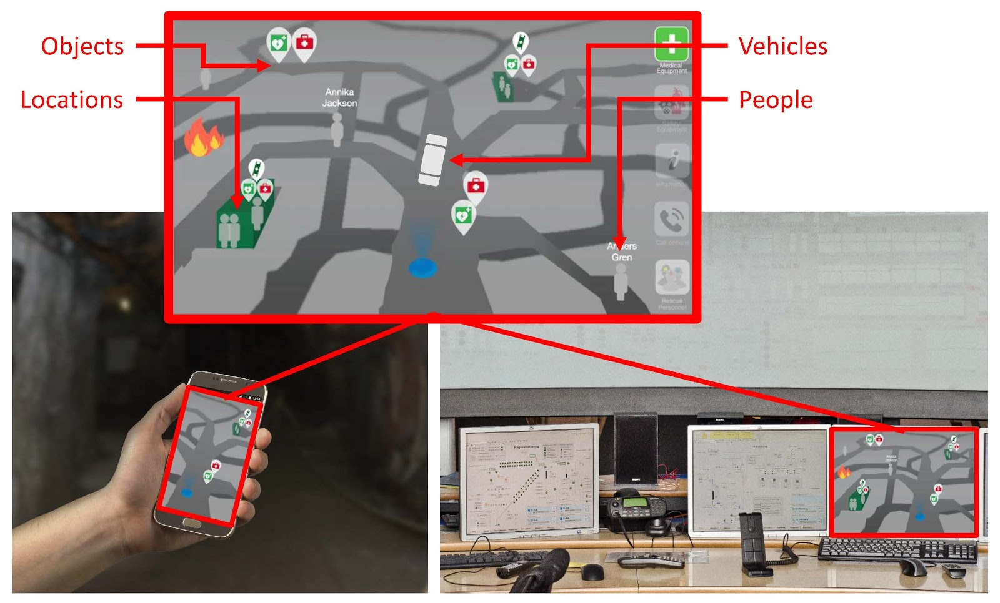
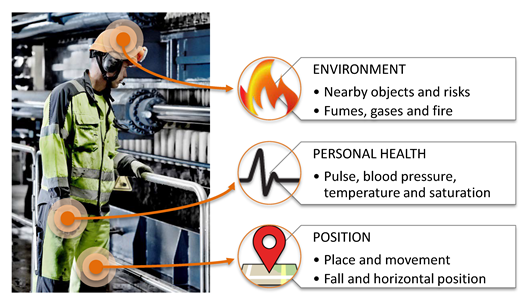

**17. Positioning technology - safety vs privacy concerns**

Camilla och Lisa

This chapter discusses the positive effects of positioning technology from a safety perspective and sets it against privacy concerns. Factors that need to be considered to enhance privacy and reduce the perception of misuse are discussed.

As can be read in Chapter 2, a recommendation for creating attractive workplaces in the mining industry is to have health and safety at work as a top priority. This can be achieved through mechanization, remote control and automation, as well as a developed safety climate. An additional way to increase safety is to use new and advanced communication and positioning technology that works in a mining environment. The communication and positioning technology allows real-time location, tracking and monitoring of vehicles, personnel and equipment. The information can be available both in control rooms on the surface and underground on mobile phones and tablets (see Figure 8.1). Such technology entails everybody, wherever they are located, information about what is going on down below (and above ground). 

{width="6.3069444444444445in" height="3.8020833333333335in"}

*Figure 8.1. The picture shows a possible map view in a mobile phone/the tableand in a control room.*

From a safety perspective, it is of course a great advantage to see peoples' exact location, for example, in case of a fire or a cave-in that requires evacuation of the mine. In such situations, time is of great importance. Without positioning technology, the rescue personnel need to spend a lot of time on getting confirmation about each worker that they are in a safe location. With a positioning system, this phase goes much faster and instead focus can be on those who have not reached safety and take decisions about who needs attention first. 

Today\'s technology makes it possible to also collect other types of information from the environment as well as from humans. Via sensors, information regarding machine functionality, temperature, tensions, vibrations and similar can be collected, as well as information of the surrounding environment such levels of fumes and gases in the air. A rather new concept is sensors worn by humans, measuring human conditions. Physiological sensors can provide information about *personal health* such as pulse and temperature; biokinetic sensors can measure posture and body movements (*position*); and ambient sensors can measure environmental factors such as temperature och sound pressure level (Johny & Anpalagan, 2014; Figure 8.2). These systems could also be useful as a preventive safety system or in case of an accident as the information can be shared with other workers close by, control room personnel, and rescue personnel. 

{width="5.514583333333333in" height="3.1680555555555556in"}

*Figure 8.2. Information that is possible to collect by positioning technology and wearable sensors. The picture of the process operator is borrowed from Boliden.*

Doubtlessly, this is a great advantage - but what do the workers think about such technology? In a safety critical situation this type of human tracking might be accepted by the workers, but the information could also be misused. As can be read in Chapter 6, one must be aware that these kinds of systems are a threat against personal integrity and must therefore be handled with care. According to Zweig and Webster (2002) there is a growing acknowledgment that technologies that track presence and activity lead to privacy concerns. Hence, when implementing such technology, psychological aspects must be taken under consideration.

**Important psychological aspects to consider**

Privacy is defined as the extent to which individuals believe they have control over their personal information and interactions with others (Stone & Stone, 1990). If the individual perceives a loss of such control it can lead to a perception of invasion of privacy. Privacy concerns are one of the most consistent reactions to awareness systems (e.g. Zweig & Webster, 2002). Hence, positioning technology and human sensors can lead to the feeling of lost control if not restricted and handled properly. Based on research and findings in the SIMS-project and other related projects, we will now briefly exemplify eight psychological aspects that are important to consider in order to avoid violating privacy and to create acceptance for technique that collects personal data.   

**First**, the collected information must be perceived as being *relevant,* i.e. necessary and appropriate to collect. Collected information that is perceived as relevant are more likely to be viewed as less invasive of privacy than information that is perceived as irrelevant (e.g. Alge, 2001). It is therefore extremely important that each bit of information that is collected can be justified on good grounds. Have in mind, even though today\'s technology makes it possible to collect all sorts of information, information should not only be collected because it is possible. The more the merrier does not apply in this context. For example, if one\'s position is of importance only from a safety perspective, then it may be of less importance to view the name of

**Second**, it is of great importance to make the *usefulness* of the technology visible for the workers to achieve acceptance (e.g. Davis, 1993). The organization must be able to communicate *why* such systems should be implemented. Like when children ask "why", "because" is not a good answer. Are you satisfied with such an answer? Hence, the organization must be able to justify the use, have a legitimate reason for implementing the system. From a privacy perspective, the individual wants to have control over what information the organization has *access* to, and how the organization will *use* the collected information (Brandimartie, Acquisti, & Loewenstein, 2012). Most important for accepting to reveal personal information is likely to be in control over how the information will be used. In this context, be careful to ensure and clarify the purposes for collecting possibly sensitive information and to communicate the true purpose. It is also important to explain the usefulness clearly. For example, make sure that the workers understand how the technology will enhance *their* safety and facilitate rescue operations. A further aspect is to emphasize the accompanying advantages such technology can have for the workers in their everyday job, in terms of being able to locate persons, vehicles and equipment, as well as providing information about the surrounding environment. 

**Third**, *participation* is a key component for enhancing employees\' perception of procedural justice and reduce feelings of invasion of privacy (Alge, 2001). It is therefore important to allow employees to be involved in both the design and implementation of the technology. The workers should be involved at an early stage, even if introducing the technology is mandatory, i.e. not optional. They should be included when discussing and deciding *what* information should be collected, *who* will have access to the information, *how* the information should be stored and handled etc. For example, knowledge of who is able to monitor you has been found to lower perceptions of privacy invasion (Zweig & Webster, 2002). One further advantage with including workers early in the process is the possibility to understand the hopes and fears. It is important to be responsive to any concerns that employees might have and try to sort them out at an early stage. Therefore, the most skeptical employees can be a valuable resource. If their concerns are listened to and met, there is a greater possibility that the technology will be accepted when implemented. 

**Fourth**, our attitudes are influenced by important others, and attitudes toward positioning technology is no exception. That means that an individual worker\'s attitude to such technology can be influenced by the attitudes of the colleagues (*social influence*). This is especially true in mandatory settings, i.e. when using the technology is not optional (e.g. Venkatesh, Morris, Davis, & Davis, 2003). The influence of others\' opinions tends to be highest in the early stages of experience with the technique, before the individual has had time to form their own opinion. Each worker\'s individual *a priori* attitude about the technology cannot simply be summed up to predict whether the group will decide to adopt the technology or not, unless they all are in agreement (Sarker, Valacich, & Sarker, 2005). If not in agreement, a complex group interaction process will start, where they attempt to influence each other, which in turn results in the group adopting or not the technology. This implies that it is important to view the implementation of new technology as a group process and therefore also handle it on a group level. Further, it is also extremely important to remember that workers also are influenced by the management and therefore, managers must communicate support and believe in the system. This means that acceptance of the technology must permeate the entire organization.

**Fifth**, the human strives for the perception of *justice.* Therefore, to achieve acceptance for positioning technology it may be of importance that everybody can see everybody\'s position. If a worker is monitored differently than other coworkers or other professionals, that worker may experience injustice (Alge, 2001). The feeling of big brother's watching you should be avoided. It has also been found that mere suspicion that the information could be used for performance monitoring creates perception of unfairness (Zweig & Webster, 2002). Hence, if there is no such intention with the system, it is important to make that clear.  

**Sixth**, another important factor that can affect acceptance for technical systems that collect personal information is *trust*. Such systems require a level of trust in the relationships between colleagues, managers and the organization. Trust in this context means, the belief that the other party (who collects the data) will behave in a responsible manner and by doing so also fulfill the trusting party's (the employees) expectations without taking advantage of its vulnerabilities (Pavlou, 2003). Hence, the employees must feel trust in that the people who have access to the information will handle it with care and not misuse it. When interviewing workers who have experience with positioning technology trust is the most frequently mentioned aspect for accepting the technology. 

**Seven**, the implementation of new technology requires *proper training*. A lot of money is spent on developing new technology but much less is spent on educating the personnel who will use it *how* to use the technology. This is a step that is often forgotten. It can be summarized as "too little training and too late". As an example, in the event of an accident it is not desirable for the personnel in the dispatch center to see the emergency functions for the first time. Further, another side of trust besides trust in relationships (see aspect sixth) is overtrust in technology. What happens if the system goes down because of a power failure and the position technology can't be used? Then it is important to have a back up plan and have had proper training on how to handle such situations with manual routines.

**Eight**, the human is generally skeptical about change, there is a fear of the unknown. Change can be perceived as stressful which leads to negative emotions and feelings of uncertainty which in turn can affect acceptance. This can be countered with thorough information. Therefore, it is extremely important to keep the personnel updated, at all stages in the implementation of positioning technology, and make sure that all personnel receive the same information (due to creating justice). 

There are of course other important aspects to consider but the purpose with this chapter was to highlight some of the most important psychological aspects that need to be considered when implementing technology that handles personal information. Below the aspects are summarized in a bullet list: 

-   Make sure that the system only collects relevant information 

-   Make sure that the usefulness of the system is visible for the individual workers

-   Make it clear what the purpose with the system is and what it is not (e.g. not performance monitoring)

-   Design and implement the technology in close cooperation with the workers

-   Consider changes as a group process (social influence)

-   Make sure that acceptance permeates the entire organization

-   Make sure that the technology is used in a fair way and create guidelines that restrict the use of the system and which include individual rights, how the information will be stored, who will have access to what information and so forth. 

-   Make sure that trust exist in the organization

-   Make sure that the users get proper training

-   Give the workers thorough information and make sure that there are forums to vent questions about expectations and fears with the technology 
